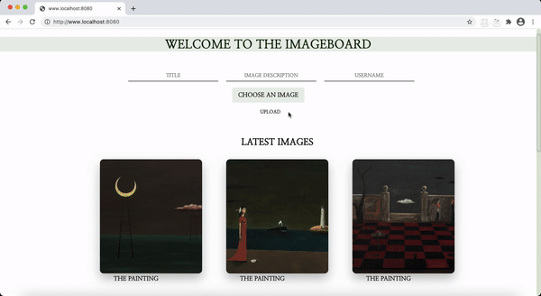

# Imageboard

An image-oriented single-page application built with Vue.js during the Bootcamp. Anyone can upload images, add a title and description and post comments on a wall. 

# Technologies: 
Node.js/Express, Vue.js, PostgreSQL, AWS S3

